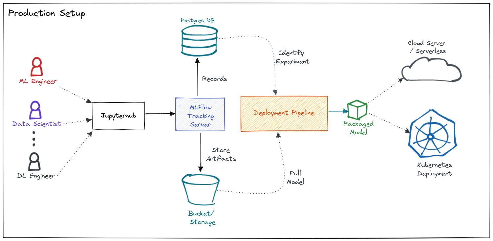
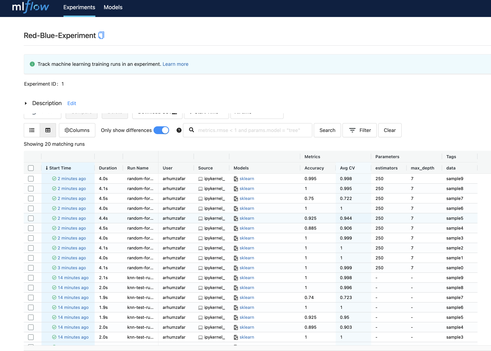

## MLflow

#### Arhum Zafar - Winter 2021
 

This repo consists of using MLflow to develop, monitor, and deploy a model. I have written a `Dockerfile` to assist with the deployment process.
 
Mlflow is a great tool that, in my opinion, can help avoid the pain of learning a new tech stack needed to maintain, track, and deploy models. When used properly, it can sit at the heart of your production environment, ensuring things are running smoothly, as seen below.
 
 

  

 

  

